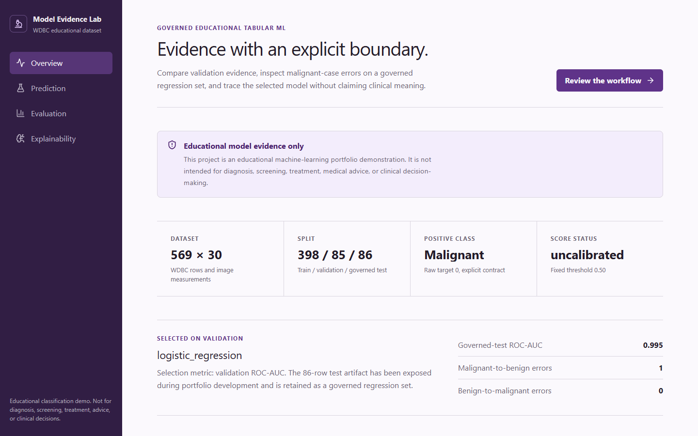

# Explainable Cancer Diagnosis ML

An educational explainable tabular-ML system that compares classifiers on a governed breast-cancer dataset split, evaluates malignant-case errors, validates model artifacts, and exposes bounded model-behavior explanations through FastAPI and React.

> **Educational-use boundary:** This project is an educational machine-learning portfolio demonstration. It is not intended for diagnosis, screening, treatment, medical advice, or clinical decision-making.

**Public showcase status:** [explainable-cancer-diagnosis-ml.vercel.app](https://explainable-cancer-diagnosis-ml.vercel.app/) is a public, read-only educational evidence dashboard. Chrome verification on 2026-08-30 confirmed the production deployment is `READY` at source main SHA `d0e279a302b497341a11fe6f97a8e10192e39636` (Vercel deployment `dpl_6rJNrmSHoSF6TjnUEyoHTFAL3cTT`). Live inference is not publicly exposed; dataset-row inference remains a local-mode capability.

Verified engineering outcomes:

- deterministic offline loading of 569 Breast Cancer Wisconsin (Diagnostic) rows with a full dataset fingerprint;
- an explicit malignant-positive label contract and leakage-safe 398/85/86 train/validation/governed-test split;
- validation-only candidate selection followed by one selected-model evaluation on the governed portfolio regression set;
- checksum-validated model, metrics, threshold, class, feature-order, SHAP, and report provenance before FastAPI inference.



## Review in under 10 minutes

1. Read the dataset, label, split, and limitation contracts below.
2. Inspect [`reports/model_comparison.md`](reports/model_comparison.md) and [`reports/error_analysis.md`](reports/error_analysis.md).
3. Run `python -m pytest` and the frontend tests.
4. Run `python -m src.pipeline --seed 42 --mlp-epochs 100`.
5. Start FastAPI, inspect `/ready`, `/model-info`, and one dataset-row `/predict` response.
6. Start React and confirm that the public mode is read-only while local mode supports dataset-row inference.

## Dataset and label contract

The project loads `sklearn.datasets.load_breast_cancer(as_frame=True)` from scikit-learn `1.6.1`. This is the Breast Cancer Wisconsin (Diagnostic) dataset. Each row contains 30 measurements computed from a digitized image of a fine-needle aspirate sample; it is not a symptom form or a current patient record.

| Contract field | Verified value |
|---|---|
| Rows / features | 569 / 30 |
| Class distribution | 212 malignant, 357 benign |
| Raw targets | `0 = malignant`, `1 = benign` |
| Safety-relevant positive class | malignant (`0`) |
| Confusion-matrix order | malignant, benign |
| Model-score column | resolved from `model.classes_`, never assumed by position |
| SHAP output class | malignant |
| Dataset SHA-256 | `f721302d723688b8cce20f5f9b5c1bfcd654703234c137b9df575fca7fe7e218` |
| Missing / duplicate feature rows | 0 / 0 |
| Physical units | not specified by the bundled dataset documentation |

The source description attributes the data to Wolberg, Street, and Mangasarian and the University of Wisconsin. See [`docs/data_source.md`](docs/data_source.md) and [`reports/dataset_metadata.md`](reports/dataset_metadata.md).

## Leakage-safe evaluation protocol

Seed `42` creates one deterministic stratified split:

| Boundary | Rows | Use |
|---|---:|---|
| Train | 398 | Fit model parameters and preprocessing |
| Validation | 85 | Compare candidates and select the model |
| Governed test | 86 | Evaluate the frozen selected model |

`StandardScaler` is fitted only on training rows. Candidate selection, early stopping, and threshold trade-off plots use no test labels. Split identity is recorded by row IDs and assignment SHA-256 `497e9350c039abd8f56c26e0fd3d6abf962bb8008fce5379f0b1790a9684df9c`.

The test rows were exposed during earlier portfolio development. This repository therefore treats them honestly as a governed regression set, not an untouched scientific benchmark.

## Model comparison and governed-test result

Candidate selection uses validation ROC-AUC with a documented tie-break that prefers Logistic Regression, then Random Forest, then Gradient Boosting when ranking values tie. The lower-complexity Logistic Regression is selected.

| Validation model | ROC-AUC | PR-AUC | Balanced accuracy | Sensitivity | Specificity |
|---|---:|---:|---:|---:|---:|
| Majority dummy | 0.5000 | 0.3765 | 0.5000 | 0.0000 | 1.0000 |
| Logistic Regression, selected | 1.0000 | 1.0000 | 0.9906 | 1.0000 | 0.9811 |
| Random Forest | 1.0000 | 1.0000 | 0.9906 | 1.0000 | 0.9811 |
| Gradient Boosting | 0.9994 | 0.9991 | 0.9749 | 0.9688 | 0.9811 |
| PyTorch MLP challenger | 1.0000 | 1.0000 | 0.9811 | 1.0000 | 0.9623 |

Frozen Logistic Regression on the 86-row governed test:

- confusion matrix `[[31, 1], [0, 54]]`, rows actual and columns model classification in malignant/benign order;
- 1 malignant-to-benign error and 0 benign-to-malignant errors;
- malignant precision `1.0000`, sensitivity `0.9688`, specificity `1.0000`;
- balanced accuracy `0.9844`, malignant F1 `0.9841`;
- ROC-AUC `0.9954`, PR-AUC `0.9938`.

One error on a small, clean dataset does not establish safety, clinical utility, or real-world performance.

## Threshold and calibration status

The model uses a fixed malignant-class score threshold of `0.50`, set before governed-test evaluation. The threshold trade-off figure is generated from validation rows only and is an educational behavior view, not a recommended medical threshold.

Scores are **uncalibrated**. API and frontend copy therefore use “malignant-class model score,” not “confidence,” “risk,” or “chance of cancer.” A score must not be interpreted as an individual clinical probability.

## Explainability boundaries

The selected pipeline uses standardized coefficients and `shap.LinearExplainer`. Binary Logistic Regression natively exposes class-1 log-odds, so the implementation explicitly negates values and the base value to reconstruct malignant-class (`0`) log-odds. Tests verify feature order, class orientation, contribution sign, and score reconstruction.

These explanations describe how the model used supplied measurements. They do not prove biological causality, medical importance, or why cancer develops. Correlated features can redistribute coefficient and SHAP attribution.

See [`docs/explainability.md`](docs/explainability.md).

## Artifact governance

`python -m src.pipeline` creates one `models/artifact_manifest.json` containing:

- dataset fingerprint, package versions, feature order, and label contract;
- split seed, row counts, row IDs, and assignment checksum;
- preprocessing boundary, selected model, validation evidence, threshold, and calibration status;
- governed-test metrics, artifact paths, SHA-256 checksums, and model version;
- the educational limitation and trusted-artifact boundary.

FastAPI fails closed when the manifest is missing, incomplete, stale, path-invalid, feature- or label-inconsistent, or checksum-invalid. `joblib` and PyTorch files are code-bearing formats; load only artifacts generated by this repository and never user-supplied paths.

Generated local artifact identity for this evidence run: `bbb5977c47501cd9a962`.

## API and dashboard

FastAPI endpoints:

- `GET /health`: process liveness;
- `GET /ready`: validated-manifest readiness;
- `GET /model-info`: version, label, threshold, calibration, and limitation metadata;
- `GET /features`: canonical ordered schema and observed range references;
- `GET /samples`: balanced educational dataset rows;
- `POST /predict`: one strict 30-feature request;
- `POST /predict-batch`: 1 to 100 strict requests.

Requests reject missing, unknown, boolean, string, non-numeric, non-finite, and oversized inputs. Values outside observed dataset ranges are accepted with explicit warning flags instead of being treated as invalid clinical ranges.

Prediction responses expose model classification, malignant-class score, threshold, calibration status, warning flags, model version, bounded feature contributions, and the full educational limitation.

The React dashboard uses the generated [`frontend/src/data/showcase_contract.json`](frontend/src/data/showcase_contract.json), not duplicated hand-entered metrics. Vercel mode is read-only. Local mode connects to FastAPI for dataset-row inference.

## Local quickstart

Python:

```bash
python -m venv .venv
```

PowerShell:

```powershell
.venv\Scripts\Activate.ps1
python -m pip install --upgrade pip
pip install -r requirements-dev.txt
python -m src.pipeline --seed 42 --mlp-epochs 100
uvicorn src.api.main:app --port 8000
```

POSIX:

```bash
source .venv/bin/activate
python -m pip install --upgrade pip
pip install -r requirements-dev.txt
python -m src.pipeline --seed 42 --mlp-epochs 100
uvicorn src.api.main:app --port 8000
```

Frontend, in a second terminal:

```bash
cd frontend
npm ci
npm run dev
```

Open `http://localhost:5173`. To update the checked-in read-only evidence snapshot after a reviewed pipeline run, rerun the pipeline with `--publish-showcase`.

Docker builds governed artifacts into the API image and never trains at container startup:

```bash
docker compose up --build
```

Docker is optional; no external API, cloud service, account, medical record, paid service, or GPU is required.

## Testing and CI

```bash
ruff format --check src tests
ruff check src tests
python -m compileall -q src tests
python -m pytest
cd frontend
npm ci
npm audit --audit-level=high
npm test
npm run build
docker compose config --quiet
```

CI runs Python formatting/linting, compilation, backend tests, frontend audit/tests/build, and Compose validation. Regression tests cover dataset and label contracts, class-score orientation, split determinism, train-only scaling, validation-only selection, metric orientation, SHAP reconstruction, artifact checksums, strict API validation, OOD warnings, request size, safety copy, generated frontend evidence, local links, and machine-path guardrails.

## Scope and limitations

- This is one deterministic split of a small, clean educational dataset.
- The governed test artifact has been inspected before and is not a pristine research holdout.
- No external, prospective, demographic-representativeness, fairness, or clinical validation is included.
- Model scores are uncalibrated and are not individual medical probabilities or risk estimates.
- Observed feature ranges are descriptive, not clinical validity bounds.
- SHAP and coefficients explain model behavior, not biology or causality.
- The local API has no authentication because it serves public educational dataset rows only.
- The project makes no claim of clinical validity, regulatory compliance, production readiness, or medical-device security.

See [`docs/limitations.md`](docs/limitations.md).

## Documentation

- [`docs/data_source.md`](docs/data_source.md)
- [`docs/modeling_approach.md`](docs/modeling_approach.md)
- [`docs/evaluation.md`](docs/evaluation.md)
- [`docs/explainability.md`](docs/explainability.md)
- [`docs/api.md`](docs/api.md)
- [`docs/frontend.md`](docs/frontend.md)
- [`PORTFOLIO_REVIEW.md`](PORTFOLIO_REVIEW.md)
