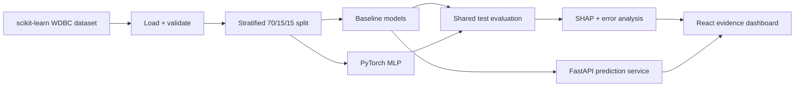
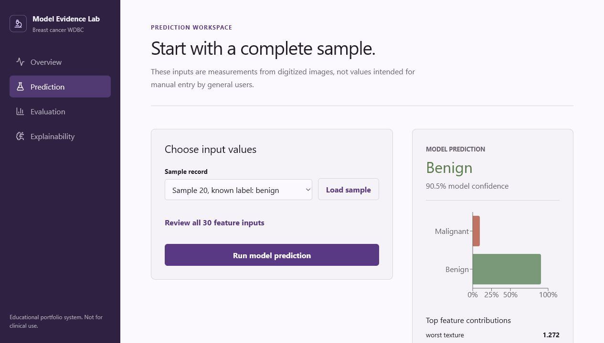
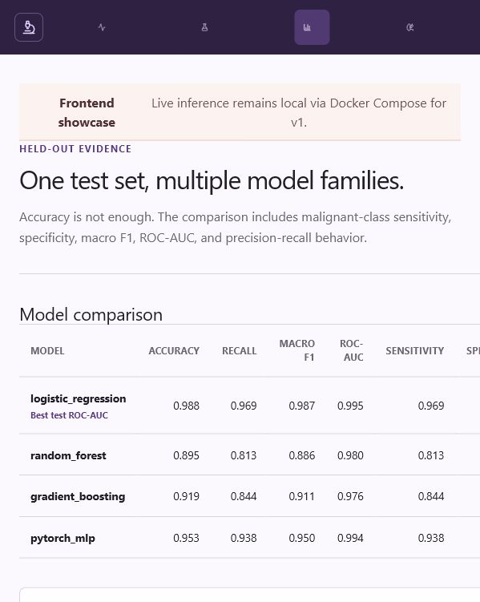
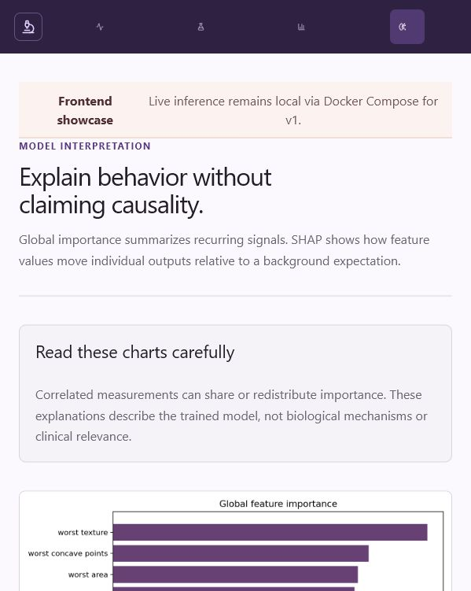

# Explainable Cancer Diagnosis ML

**Live demo:** https://explainable-cancer-diagnosis-ml.vercel.app

End-to-end tabular machine learning portfolio project using the Breast Cancer Wisconsin Diagnostic dataset from scikit-learn. It compares scikit-learn models and a PyTorch MLP, evaluates safety-relevant classification metrics, explains model behavior with SHAP, serves strict inference through FastAPI, and presents the evidence in a React dashboard.

> **Medical disclaimer:** This system is a machine learning portfolio demo and is not intended for medical diagnosis or clinical decision-making.

## Problem Statement

Classify each dataset sample as malignant (`0`) or benign (`1`) while demonstrating:

- reproducible offline data loading and validation;
- leakage-safe preprocessing and fair model comparison;
- sensitivity, specificity, macro F1, ROC-AUC, and error analysis;
- global and local explainability;
- production-style API contracts and a usable interpretation dashboard.

## Dataset

The project uses `sklearn.datasets.load_breast_cancer(as_frame=True)`. The dataset contains 569 rows and 30 numeric measurements computed from digitized breast-mass images. No login, scraping, Kaggle account, or external download is required.

See [docs/data_source.md](docs/data_source.md).

## Measured Results

Seed: `42`. Shared held-out test set: 86 rows. Malignant is treated as the safety-relevant positive class for precision, recall, sensitivity, and ROC-AUC.

| Model | Accuracy | Precision | Recall | F1 | ROC-AUC | Sensitivity | Specificity |
|---|---:|---:|---:|---:|---:|---:|---:|
| Logistic Regression | 0.9884 | 1.0000 | 0.9688 | 0.9841 | 0.9954 | 0.9688 | 1.0000 |
| Random Forest | 0.8953 | 0.8966 | 0.8125 | 0.8525 | 0.9797 | 0.8125 | 0.9444 |
| Gradient Boosting | 0.9186 | 0.9310 | 0.8438 | 0.8852 | 0.9757 | 0.8438 | 0.9630 |
| PyTorch MLP | 0.9535 | 0.9375 | 0.9375 | 0.9375 | 0.9936 | 0.9375 | 0.9630 |

Logistic Regression is selected by validation ROC-AUC. On the test set it produced one malignant-to-benign error and no benign-to-malignant errors. These results are educational and are not evidence of clinical validity.

## Tech Stack

- Python 3.10+, pandas, NumPy, scikit-learn
- PyTorch, SHAP, MLflow (optional local tracking)
- FastAPI, Pydantic, Uvicorn
- React 19, Vite 8, TypeScript, Tailwind CSS 4, Recharts
- pytest, Vitest, Docker Compose, GitHub Actions

## Architecture



Production logic lives under `src/`; notebooks call those modules instead of duplicating training code.

## Local Setup

### Windows PowerShell

```powershell
python -m venv .venv
.venv\Scripts\Activate.ps1
python -m pip install --upgrade pip
pip install -r requirements.txt
```

If `python` opens the Microsoft Store alias, use an installed Python 3.10+ executable directly.

### macOS or Linux

```bash
python3 -m venv .venv
source .venv/bin/activate
python -m pip install --upgrade pip
pip install -r requirements.txt
```

## Reproduce the Pipeline

```bash
python -m src.data.load_dataset
python -m src.data.validate_dataset
python -m src.evaluation.generate_eda
python -m src.models.train_baseline --seed 42
python -m src.models.train_pytorch_mlp --seed 42 --epochs 100 --batch-size 32
python -m src.evaluation.evaluate_models
python -m src.evaluation.error_analysis
python -m src.explainability.explain_model
```

Generated models, metrics JSON, and figures are intentionally ignored by Git. Run these commands after cloning.

## API

```bash
uvicorn src.api.main:app --reload --port 8000
```

- Swagger UI: `http://localhost:8000/docs`
- `GET /health`
- `GET /model-info`
- `GET /features`
- `GET /samples`
- `POST /predict`
- `POST /predict-batch` (maximum 100 rows)

The prediction schema requires exactly the 30 named finite numeric features. Numeric strings, missing keys, unknown keys, booleans, and non-finite values are rejected.

See [docs/api.md](docs/api.md).

## Frontend

```bash
cd frontend
npm install
npm run dev
```

Open `http://localhost:5173`. The dashboard leads with sample-based prediction and progressively reveals the 30-feature form.

Pages:

- Overview
- Prediction
- Model Evaluation
- Explainability

See [docs/frontend.md](docs/frontend.md).

## Frontend Deployment

Production frontend:

https://explainable-cancer-diagnosis-ml.vercel.app

Vercel hosts a read-only showcase with measured evaluation and explainability artifacts. Live
prediction is intentionally not exposed from Vercel in v1. Run `docker compose up --build` to use
the sample-based inference workflow with the local FastAPI backend.

The backend may be deployed later as a separate Docker service, such as Hugging Face Spaces. It is
not deployed to Vercel or Netlify.

## MLflow

MLflow is optional. Normal training does not import or require an MLflow server.

```bash
pip install -r requirements-mlflow.txt
python -m src.models.train_baseline --seed 42 --mlflow
python -m src.models.train_pytorch_mlp --seed 42 --epochs 100 --mlflow
mlflow ui
```

Open `http://localhost:5000`. Local `mlruns/` and `mlartifacts/` directories are ignored.

## Docker

Docker is optional:

```bash
docker compose up --build
```

- Frontend: `http://localhost:5173`
- API: `http://localhost:8000`
- API docs: `http://localhost:8000/docs`

The API container bootstraps local demo artifacts when they are absent.

## Tests

```bash
python -m pytest
cd frontend
npm test
npm run build
```

Backend tests cover data loading, split behavior, model artifacts, PyTorch checkpoints, report generation, strict prediction schemas, and API endpoints. Frontend tests cover the safety disclaimer and sample-first workflow.

## Project Structure

```text
src/
  data/              dataset loading and validation
  features/          deterministic splitting and scaling
  models/            scikit-learn and PyTorch training
  evaluation/        metrics, EDA, curves, error analysis
  explainability/    feature importance and SHAP
  api/               schemas, prediction service, FastAPI
frontend/            React/Vite dashboard
notebooks/           orchestration and exploration
tests/               public-behavior tests
docs/                technical and portfolio documentation
```

## Explainability

The selected Logistic Regression model is most influenced globally by features including `worst texture`, `worst concave points`, `worst area`, and `worst radius`. SHAP summary and waterfall plots describe model behavior only. Correlated features can redistribute importance, and explanations do not establish causality.

See [docs/explainability.md](docs/explainability.md).

## Screenshots








## Limitations

- The dataset is small, clean, and educational compared with real clinical data.
- No external or prospective validation is included.
- Feature measurements are not user-friendly manual inputs.
- Model probabilities are not calibrated for clinical interpretation.
- SHAP explains the model, not biology or causality.
- High test scores on this dataset do not imply real-world medical performance.

See [docs/limitations.md](docs/limitations.md).

## Future Improvements

- threshold tuning and calibration views;
- CSV batch upload;
- confidence and drift monitoring;
- ONNX export;
- independent external dataset validation;
- generated model cards and richer experiment comparison.

## Resume Bullet

Built a local-first explainable tabular ML system using scikit-learn, PyTorch, SHAP, FastAPI, and React to compare classifiers on a shared test set, analyze safety-relevant errors, serve strict 30-feature inference, and explain model outputs through an interactive dashboard.

## Portfolio Review

See [PORTFOLIO_REVIEW.md](PORTFOLIO_REVIEW.md) for reviewer paths, demonstrated skills, and honest remaining gaps.
